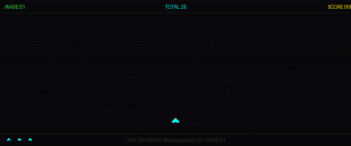
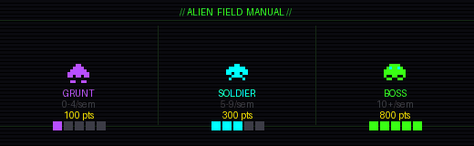

  
  

&nbsp;

---

  <a href="https://git.io/typing-svg">
    +INITIALIZING+DEV+PROFILE+.+.+.;>+USERNAME:+philippluca123;>+STATUS:+ONLINE;>+LOADING+STATS+.+.+.+||||||||||||||+100%25" alt="Typing SVG" />
  </a>

---

  
 
  
 

---

## CONTRIBUTIONS INVASION

> *Cada linha de contribuição vira um alien no campo de batalha. A nave defende o repositório.*
> *Gerado automaticamente toda semana via GitHub Actions.*

  

---

---

  
  
  
