<!-- HEADER -->
<div align="center">

```
╔══════════════════════════════════════════════════════════════╗
║                                                              ║
║   ██████╗ ██╗  ██╗██╗██╗     ██╗██████╗ ██████╗  ███████╗  ║
║   ██╔══██╗██║  ██║██║██║     ██║██╔══██╗██╔══██╗ ██╔════╝  ║
║   ██████╔╝███████║██║██║     ██║██████╔╝██████╔╝ ███████╗  ║
║   ██╔═══╝ ██╔══██║██║██║     ██║██╔═══╝ ██╔═══╝  ╚════██║  ║
║   ██║     ██║  ██║██║███████╗██║██║     ██║       ███████║  ║
║   ╚═╝     ╚═╝  ╚═╝╚═╝╚══════╝╚═╝╚═╝     ╚═╝      ╚══════╝  ║
║                                                              ║
╚══════════════════════════════════════════════════════════════╝
```

<a href="https://git.io/typing-svg">
  
</a>

<br/>


&nbsp;
[](https://github.com/philippluca123)

</div>

---

<!-- ABOUT -->
<div align="center">

```
> INITIALIZING PLAYER PROFILE...
> USERNAME: philippluca123
> STATUS: ONLINE
> LOADING STATS... ████████████████ 100%
```

</div>

---

<!-- GITHUB STATS -->
## `// STATS`

<div align="center">


&nbsp;


</div>

---

<!-- LANGUAGES -->
## `// LANGUAGES`

<div align="center">


</div>

---

<!-- ACTIVITY GRAPH -->
## `// ACTIVITY`

<div align="center">


</div>

---

<!-- PROJECTS -->
## `// FEATURED PROJECTS`

<div align="center">

> ⚠️ **Substitua os repos abaixo pelos seus projetos reais!**

<a href="https://github.com/philippluca123/REPO-1">
  
</a>
&nbsp;
<a href="https://github.com/philippluca123/REPO-2">
  
</a>

<a href="https://github.com/philippluca123/REPO-3">
  
</a>
&nbsp;
<a href="https://github.com/philippluca123/REPO-4">
  
</a>

</div>

---

<!-- GALAGA -->
## `// GALAGA — CONTRIBUTIONS INVASION`

<div align="center">

> *Cada linha de contribuição vira um alien no campo de batalha. A nave defende o repositório.*
> *Gerado automaticamente toda semana via GitHub Actions.*



</div>

---

<!-- CONTACT -->
## `// CONTACT`

<div align="center">

```
╔══════════════════════════════╗
║    FIND ME IN THE WILD       ║
╚══════════════════════════════╝
```

[](https://github.com/philippluca123)
[](https://linkedin.com/in/SEU-LINKEDIN)
[](mailto:SEU@EMAIL.COM)

<br/>

```
> THANKS FOR VISITING — INSERT COIN TO CONTINUE...
```

</div>

---

<div align="center">
  <sub>
    <code>README gerado com ❤️ + estética arcade • philippluca123</code>
  </sub>
</div>
